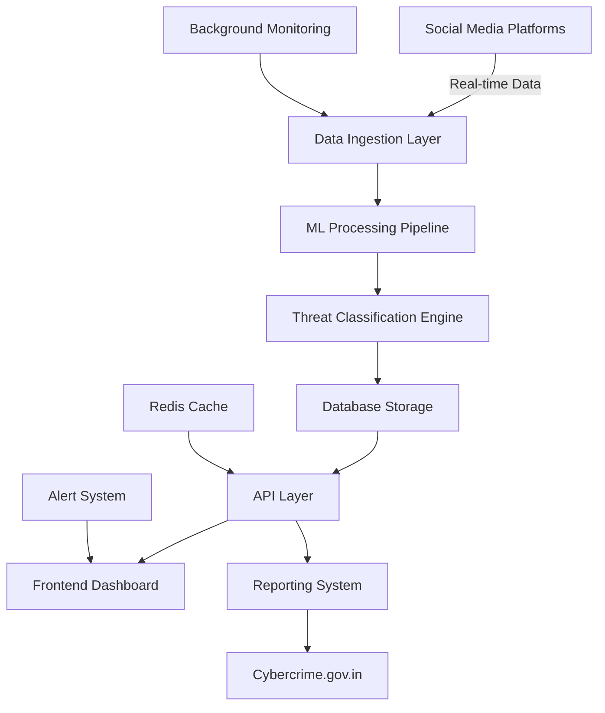
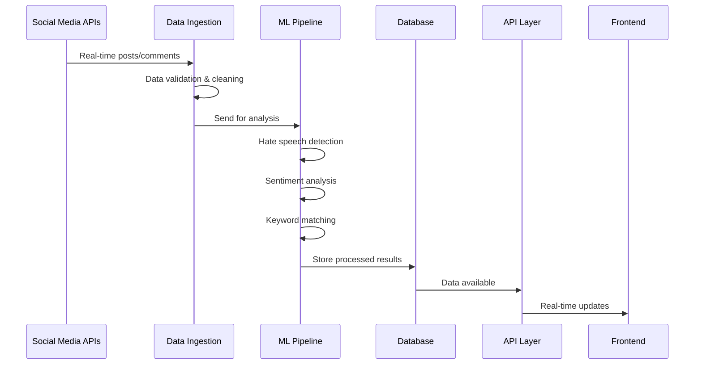
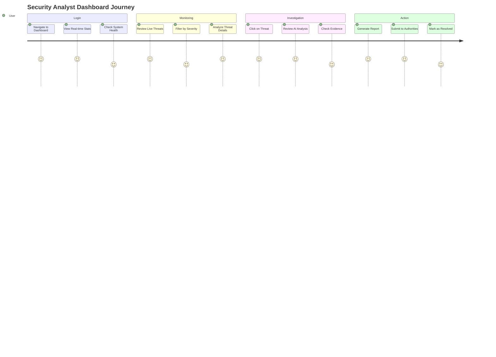
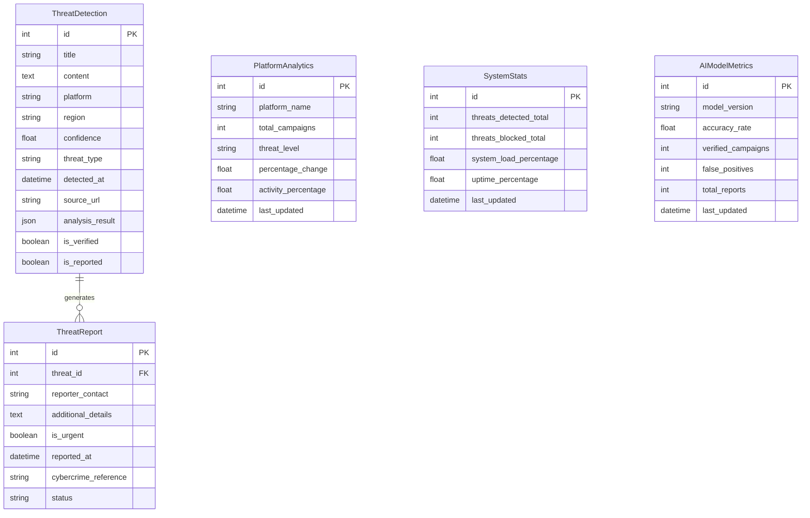

# Aatra AI - Technical Documentation

<div align="center">

# 🛡️ Aatra AI - Anti-India Campaign Monitoring System (AICMS)
## Comprehensive Technical Documentation

[](https://www.python.org)
[](https://fastapi.tiangolo.com)
[](https://huggingface.co/transformers)
[](https://github.com)

</div>

---

## 📋 Table of Contents

1. [Problem Statement](#-problem-statement)
2. [Solution Architecture](#-solution-architecture)
3. [Technical Stack](#-technical-stack)
4. [System Flow](#-system-flow)
5. [User Flow](#-user-flow)
6. [Component Deep Dive](#-component-deep-dive)
7. [Machine Learning Pipeline](#-machine-learning-pipeline)
8. [API Architecture](#-api-architecture)
9. [Database Design](#-database-design)
10. [Security Implementation](#-security-implementation)
11. [Performance & Scalability](#-performance--scalability)
12. [Deployment Strategy](#-deployment-strategy)

---

## 🎯 Problem Statement

### The Challenge
India faces a significant digital threat through coordinated anti-India campaigns across social media platforms. These campaigns include:

- **Hate Speech**: Direct attacks on Indian institutions, culture, and people
- **Disinformation**: False narratives about India's achievements and policies
- **Separatist Content**: Content promoting division and anti-national sentiment
- **Coordinated Attacks**: Bot networks spreading inflammatory content
- **Cross-Platform Campaigns**: Synchronized attacks across multiple social media platforms

### Current Gaps
1. **Manual Monitoring**: Traditional monitoring requires human intervention and is slow
2. **Limited Scale**: Cannot process millions of social media posts in real-time
3. **No AI Integration**: Lack of intelligent threat detection and classification
4. **Delayed Response**: By the time threats are identified, damage is already done
5. **Fragmented Reporting**: No unified system for reporting to law enforcement

### Our Solution Impact
- **Real-time Detection**: Instant identification of anti-India content
- **AI-Powered Analysis**: Intelligent classification with confidence scoring
- **Automated Reporting**: Direct integration with cybercrime.gov.in
- **Cross-Platform Monitoring**: Unified monitoring across 8+ social platforms
- **Scalable Architecture**: Can handle millions of posts with ML processing

---

## 🏗️ Solution Architecture

### High-Level Architecture



### Component Architecture

```
┌─────────────────────────────────────────────────────────────────┐
│                        Frontend Layer                           │
├─────────────────────────────────────────────────────────────────┤
│  • Real-time Dashboard    • Content Analysis    • Reporting UI  │
│  • Platform Analytics    • AI Learning Center  • Admin Panel   │
└─────────────────────┬───────────────────────────────────────────┘
                      │ HTTPS/REST API
┌─────────────────────▼───────────────────────────────────────────┐
│                      API Gateway Layer                          │
├─────────────────────────────────────────────────────────────────┤
│  • Authentication    • Rate Limiting      • CORS Handling      │
│  • Request Routing   • Response Caching   • Error Handling     │
└─────────────────────┬───────────────────────────────────────────┘
                      │
┌─────────────────────▼───────────────────────────────────────────┐
│                   Business Logic Layer                          │
├─────────────────────────────────────────────────────────────────┤
│  • Dashboard APIs    • Analysis APIs     • Reporting APIs      │
│  • Social Monitor    • Threat Processor  • Alert Generator     │
└─────────┬───────────┬───────────┬───────────────────────────────┘
          │           │           │
          ▼           ▼           ▼
┌─────────────┐ ┌─────────────┐ ┌─────────────────────────────────┐
│     ML      │ │  Database   │ │      External Services          │
│  Pipeline   │ │   Layer     │ │                                 │
├─────────────┤ ├─────────────┤ ├─────────────────────────────────┤
│ • Hate      │ │ •PostgreSQL │ │ • Twitter/X API                 │
│   Detection │ │ • Redis     │ │ • Facebook Graph API            │
│ • Sentiment │ │   Cache     │ │ • Instagram Basic Display       │
│   Analysis  │ │ • Vector    │ │ • WhatsApp Business API         │
│ • Keyword   │ │   Database  │ │ • Cybercrime.gov.in Portal      │
│   Matching  │ │             │ │                                 │
└─────────────┘ └─────────────┘ └─────────────────────────────────┘
```

---

## 💻 Technical Stack

### Backend Technologies
```yaml
Core Framework:
  - FastAPI: Modern Python web framework with automatic API docs
  - Uvicorn: ASGI server for production deployment
  - Pydantic: Data validation and settings management

Database & Caching:
  - PostgreSQL: Primary database for structured data
  - Redis: High-performance caching and session storage
  - SQLAlchemy: Python SQL toolkit and ORM

Machine Learning:
  - Hugging Face Transformers: Pre-trained models for NLP
  - PyTorch: Deep learning framework
  - scikit-learn: Traditional ML algorithms
  - NLTK/spaCy: Natural language processing utilities

Social Media Integration:
  - Tweepy: Twitter/X API client
  - Facebook Graph API: Meta platforms integration
  - Instagram Basic Display API: Instagram monitoring
  - WhatsApp Business API: WhatsApp group monitoring

Monitoring & Analytics:
  - Prometheus: Metrics collection
  - Grafana: Metrics visualization
  - APM: Application performance monitoring
  - Logging: Structured logging with JSON format
```

### Frontend Technologies
```yaml
Core Technologies:
  - HTML5: Semantic markup with accessibility
  - Vanilla JavaScript: No framework dependencies for performance
  - ES6+ Features: Modern JavaScript with async/await

Styling & UI:
  - Tailwind CSS: Utility-first CSS framework via CDN
  - Glass-morphism: Modern UI design trends
  - Responsive Design: Mobile-first approach
  - Inter Font: Professional typography

Data Visualization:
  - Chart.js: Interactive charts and graphs
  - Real-time Updates: WebSocket or polling for live data
  - Progressive Enhancement: Works without JavaScript

API Integration:
  - Fetch API: Modern HTTP client
  - Error Handling: Comprehensive error states
  - Loading States: User feedback during operations
  - Caching: Client-side caching for performance
```

### DevOps & Infrastructure
```yaml
Containerization:
  - Docker: Application containerization
  - Docker Compose: Multi-service orchestration
  - Multi-stage Builds: Optimized production images

Web Server:
  - Nginx: Reverse proxy and static file serving
  - SSL/TLS: HTTPS encryption with Let's Encrypt
  - Load Balancing: Multiple backend instances

Monitoring:
  - Health Checks: Application and infrastructure monitoring
  - Log Aggregation: Centralized logging system
  - Alerting: Real-time incident notifications
  - Backup Strategy: Automated database backups
```

---

## 🔄 System Flow

### 1. Data Ingestion Flow



### 2. Threat Detection Flow

```
┌─────────────────┐    ┌─────────────────┐    ┌─────────────────┐
│   Social Media  │    │  Data Ingestion │    │   Preprocessing │
│     Content     │───▶│     Service     │───▶│     Pipeline    │
└─────────────────┘    └─────────────────┘    └─────────────────┘
                                                        │
┌─────────────────┐    ┌─────────────────┐    ┌─────────▼───────┐
│   Threat Alert  │    │   Classification│    │  ML Processing  │
│     System      │◄───│     Engine      │◄───│     Engine      │
└─────────────────┘    └─────────────────┘    └─────────────────┘
         │                                              │
         ▼                                              ▼
┌─────────────────┐    ┌─────────────────┐    ┌─────────────────┐
│   Reporting     │    │     Database    │    │   Confidence    │
│     Portal      │    │     Storage     │    │    Scoring      │
└─────────────────┘    └─────────────────┘    └─────────────────┘
```

### 3. Real-time Processing Pipeline

```python
# Simplified processing flow
async def process_content_pipeline(content):
    """
    Real-time content processing pipeline
    """
    # Step 1: Data Validation
    validated_content = validate_input(content)
    
    # Step 2: Preprocessing
    cleaned_content = preprocess_text(validated_content)
    
    # Step 3: ML Analysis
    analysis_result = await ml_pipeline.analyze(cleaned_content)
    
    # Step 4: Threat Classification
    threat_level = classify_threat(analysis_result)
    
    # Step 5: Database Storage
    threat_id = await store_threat(content, analysis_result, threat_level)
    
    # Step 6: Real-time Notification
    await notify_dashboard(threat_id, threat_level)
    
    # Step 7: Auto-reporting (if critical)
    if threat_level == "critical":
        await auto_report_to_authorities(threat_id)
    
    return analysis_result
```

---

## 👤 User Flow

### 1. Dashboard User Journey



### 2. Content Analysis User Flow

```
User Input → Validation → ML Processing → Results Display → Action Options
    │             │            │              │               │
    ▼             ▼            ▼              ▼               ▼
┌─────────┐ ┌─────────┐ ┌─────────────┐ ┌─────────────┐ ┌─────────────┐
│ Paste   │ │ Check   │ │ Hate Speech │ │ Risk Level  │ │ Report/Save │
│ Text/URL│ │ Length  │ │ Detection   │ │ Confidence  │ │ Share       │
│         │ │ Format  │ │ Sentiment   │ │ Indicators  │ │ Export      │
└─────────┘ └─────────┘ └─────────────┘ └─────────────┘ └─────────────┘
```

### 3. Detailed User Interactions

#### **Security Analyst Workflow**
1. **Login & Overview**
   - Access dashboard at http://localhost:3000
   - View system health indicators
   - Review threat statistics and trends

2. **Threat Monitoring**
   - Monitor live threat feed
   - Filter threats by severity (Critical, High, Medium, Low)
   - Sort by platform, region, or time

3. **Threat Investigation**
   - Click on specific threat for details
   - Review AI analysis results
   - Examine evidence and indicators
   - Check source URLs and user profiles

4. **Action Taking**
   - Generate detailed report
   - Submit report to cybercrime.gov.in
   - Mark threats as verified or false positive
   - Add to monitoring watchlist

#### **Content Analyst Workflow**
1. **Content Input**
   - Navigate to "Content Analysis" tab
   - Paste text content or provide URL
   - Specify platform context

2. **AI Analysis**
   - Click "✨ Analyze Content" button
   - Wait for ML processing (2-5 seconds)
   - Review comprehensive analysis results

3. **Results Review**
   - Check risk level (Low/Moderate/High/Critical)
   - Review confidence percentage
   - Examine detected indicators
   - Read recommended actions

4. **Follow-up Actions**
   - Save analysis for future reference
   - Generate report if needed
   - Share findings with team
   - Add keywords to monitoring list

---

## 🔧 Component Deep Dive

### 1. ML Processing Pipeline (`backend/app/ml/`)

#### **Hate Detection Engine**
```python
class AntiIndiaHateDetector:
    """
    Advanced ML pipeline for detecting anti-India hate speech
    """
    
    def __init__(self):
        # Load pre-trained transformers model
        self.model = AutoModelForSequenceClassification.from_pretrained(
            "martin-ha/toxic-comment-model"
        )
        self.tokenizer = AutoTokenizer.from_pretrained("martin-ha/toxic-comment-model")
        
        # Anti-India specific patterns
        self.anti_india_keywords = [
            "hate india", "destroy india", "india terrorist",
            "khalistan", "azad kashmir", "pakistan zindabad"
        ]
    
    def analyze_content(self, text: str) -> Dict:
        """
        Comprehensive threat analysis with multiple detection methods
        """
        # 1. Text preprocessing
        clean_text = self.preprocess_text(text)
        
        # 2. Transformer-based hate detection
        hate_score = self.classify_hate_speech(clean_text)
        
        # 3. Keyword-based anti-India detection
        keyword_score = self.detect_anti_india_keywords(clean_text)
        
        # 4. Contextual analysis
        context_score = self.analyze_context(clean_text)
        
        # 5. Final threat scoring
        final_score = self.calculate_threat_score(
            hate_score, keyword_score, context_score
        )
        
        return {
            "riskLevel": self.determine_risk_level(final_score),
            "confidence": final_score,
            "indicators": self.generate_indicators(text),
            "recommendedAction": self.generate_recommendation(final_score)
        }
```

#### **Processing Stages**
1. **Text Preprocessing**: Clean URLs, normalize text, handle special characters
2. **Tokenization**: Convert text to model-compatible tokens
3. **Feature Extraction**: Extract linguistic and semantic features
4. **Classification**: Multi-model ensemble for robust detection
5. **Post-processing**: Confidence calibration and result formatting

### 2. Social Media Monitoring (`backend/app/services/social_monitor.py`)

#### **Real-time Data Collection**
```python
class SocialMediaMonitor:
    """
    Real-time social media monitoring across multiple platforms
    """
    
    async def monitor_platforms(self):
        """
        Continuous monitoring of social media platforms
        """
        platforms = {
            'twitter': self.monitor_twitter,
            'facebook': self.monitor_facebook,
            'instagram': self.monitor_instagram,
            'whatsapp': self.monitor_whatsapp_groups
        }
        
        # Parallel monitoring
        tasks = [
            asyncio.create_task(monitor_func())
            for monitor_func in platforms.values()
        ]
        
        await asyncio.gather(*tasks)
    
    async def process_detected_content(self, content):
        """
        Process and classify detected content
        """
        # ML analysis
        analysis = await self.ml_pipeline.analyze(content)
        
        # Store in database
        threat_id = await self.store_threat(content, analysis)
        
        # Real-time alerts
        if analysis['riskLevel'] in ['Critical Risk', 'High Risk']:
            await self.send_alert(threat_id)
        
        # Auto-reporting for critical threats
        if analysis['riskLevel'] == 'Critical Risk':
            await self.auto_report(threat_id)
```

### 3. API Layer (`backend/app/api/`)

#### **Dashboard APIs**
```python
# Real-time statistics
@router.get("/dashboard/stats")
async def get_dashboard_stats():
    return {
        "threatsDetected": await count_total_threats(),
        "threatsBlocked": await count_blocked_threats(),
        "systemLoad": await get_system_load(),
        "uptime": await calculate_uptime()
    }

# Live threat feed
@router.get("/dashboard/threats/live")
async def get_live_threats(filter_type: str = "all"):
    threats = await fetch_threats_by_filter(filter_type)
    return {
        "threats": format_threats_for_frontend(threats),
        "counts": await get_threat_counts_by_type()
    }
```

#### **Analysis APIs**
```python
# Content analysis endpoint
@router.post("/analysis/content")
async def analyze_content(request: ContentAnalysisRequest):
    # Validate input
    if not request.content or len(request.content) < 3:
        raise HTTPException(400, "Content too short")
    
    # ML processing
    result = hate_detector.analyze_content(request.content)
    
    # Store significant threats
    if result['confidence'] >= 50:
        await store_analysis_result(request, result)
    
    return result
```

### 4. Database Layer (`backend/app/models.py`)

#### **Core Data Models**
```python
class ThreatDetection(Base):
    """
    Central table for all detected threats
    """
    __tablename__ = "threat_detections"
    
    id = Column(Integer, primary_key=True)
    title = Column(String(500))              # Generated threat title
    content = Column(Text)                   # Original content
    platform = Column(String(50))           # twitter, facebook, etc.
    region = Column(String(100))             # Geographic origin
    confidence = Column(Float)               # ML confidence (0-100)
    threat_type = Column(String(20))         # critical, high, medium, low
    detected_at = Column(DateTime)           # Detection timestamp
    source_url = Column(String(1000))        # Original post URL
    analysis_result = Column(JSON)           # Full ML analysis
    is_verified = Column(Boolean)            # Human verification
    is_reported = Column(Boolean)            # Reported to authorities

class PlatformAnalytics(Base):
    """
    Platform-wise threat analytics
    """
    __tablename__ = "platform_analytics"
    
    platform_name = Column(String(50))      # Platform identifier
    total_campaigns = Column(Integer)        # Total detected campaigns
    threat_level = Column(String(20))        # CRITICAL, HIGH, MODERATE, LOW
    percentage_change = Column(Float)        # Change from previous period
    activity_percentage = Column(Float)      # Activity level (0-100)
```

---

## 🤖 Machine Learning Pipeline

### 1. Multi-Model Approach

#### **Primary Detection Models**
```yaml
Transformer Models:
  - martin-ha/toxic-comment-model: Hate speech detection
  - cardiffnlp/twitter-roberta-base-sentiment: Sentiment analysis
  - unitary/toxic-bert: Alternative hate detection

Traditional ML:
  - TF-IDF + SVM: Fast keyword classification
  - Naive Bayes: Probabilistic text classification
  - Logistic Regression: Linear hate speech detection

Custom Models:
  - Anti-India Keyword Classifier: Domain-specific detection
  - Separatist Content Detector: Regional threat detection
  - Coordinated Behavior Detection: Bot network identification
```

#### **Model Pipeline Architecture**
```python
class MLPipeline:
    """
    Ensemble ML pipeline for robust threat detection
    """
    
    def __init__(self):
        self.models = {
            'transformer': self.load_transformer_model(),
            'traditional': self.load_traditional_models(),
            'keyword': self.load_keyword_classifier(),
            'custom': self.load_custom_models()
        }
    
    async def analyze_content(self, content: str) -> Dict:
        """
        Multi-model ensemble analysis
        """
        results = {}
        
        # Parallel model inference
        tasks = [
            self.transformer_analysis(content),
            self.traditional_analysis(content), 
            self.keyword_analysis(content),
            self.custom_analysis(content)
        ]
        
        model_results = await asyncio.gather(*tasks)
        
        # Ensemble combination
        final_score = self.combine_model_outputs(model_results)
        
        return self.format_results(final_score, model_results)
```

### 2. Feature Engineering

#### **Text Features**
- **Lexical Features**: Character count, word count, sentence structure
- **Syntactic Features**: POS tags, dependency parsing, grammar patterns
- **Semantic Features**: Word embeddings, contextual embeddings
- **Stylistic Features**: Punctuation patterns, capitalization, emoticons

#### **Platform-Specific Features**
- **Twitter**: Hashtags, mentions, retweet patterns, follower analysis
- **Facebook**: Post engagement, group dynamics, sharing patterns
- **Instagram**: Caption analysis, hashtag trends, story content
- **WhatsApp**: Group dynamics, forwarding patterns, contact analysis

### 3. Training & Evaluation

#### **Dataset Composition**
```yaml
Training Data:
  - Hate Speech Datasets: 100K+ labeled examples
  - Anti-India Specific: 10K+ manually labeled examples
  - Social Media Context: Platform-specific examples
  - Multilingual Content: Hindi, English, regional languages

Evaluation Metrics:
  - Accuracy: Overall classification accuracy
  - Precision: Hate speech detection precision
  - Recall: Anti-India content recall
  - F1-Score: Balanced performance measure
  - AUC-ROC: Classification discrimination ability
```

---

## 🔗 API Architecture

### 1. RESTful API Design

#### **API Endpoint Structure**
```
BASE_URL: http://localhost:8000/api

Dashboard APIs:
├── GET    /dashboard/stats           # Real-time statistics
├── GET    /dashboard/threats/live    # Live threat feed
├── GET    /dashboard/platforms       # Platform analytics
└── POST   /dashboard/threats/summarize # AI threat summary

Analysis APIs:
├── POST   /analysis/content          # Analyze text content
├── POST   /analysis/url              # Analyze URL content
├── GET    /analysis/keywords         # Get monitoring keywords
└── POST   /analysis/keywords         # Add monitoring keywords

Reporting APIs:
├── POST   /reports/create            # Create threat report
├── GET    /reports/generate/{id}     # Generate report content
├── GET    /reports/status/{id}       # Check report status
└── GET    /reports/list              # List all reports

System APIs:
├── GET    /health                    # Health check
├── GET    /metrics                   # System metrics
└── GET    /docs                      # API documentation
```

### 2. Request/Response Formats

#### **Content Analysis Request**
```json
{
  "content": "Text content to analyze",
  "url": "https://optional-source-url.com",
  "platform": "twitter",
  "context": {
    "user_id": "optional_user_identifier",
    "timestamp": "2024-01-01T00:00:00Z",
    "metadata": {}
  }
}
```

#### **Analysis Response**
```json
{
  "riskLevel": "High Risk",
  "confidence": 85,
  "summary": "High-risk content identified with concerning anti-India sentiment...",
  "indicators": [
    "Anti-India keywords detected: hate india, destroy india",
    "Hate speech patterns identified (confidence: 78.5%)",
    "Coordinated messaging indicators present"
  ],
  "recommendedAction": "HIGH PRIORITY: Report to appropriate authorities...",
  "metadata": {
    "processing_time_ms": 1250,
    "model_version": "v2.4.1",
    "analysis_id": "analysis_12345"
  }
}
```

### 3. Authentication & Security

#### **API Security Features**
```python
# Rate limiting
@app.middleware("http")
async def rate_limit_middleware(request: Request, call_next):
    client_ip = request.client.host
    if await is_rate_limited(client_ip):
        return JSONResponse(
            status_code=429,
            content={"error": "Rate limit exceeded"}
        )
    return await call_next(request)

# Request validation
class ContentAnalysisRequest(BaseModel):
    content: str = Field(..., min_length=1, max_length=10000)
    platform: str = Field(default="unknown", regex="^[a-zA-Z0-9_-]+$")
    
    @validator('content')
    def validate_content(cls, v):
        # Content sanitization
        if contains_malicious_patterns(v):
            raise ValueError('Content contains potentially harmful patterns')
        return sanitize_text(v)
```

---

## 🗄️ Database Design

### 1. Entity Relationship Diagram



### 2. Database Optimization

#### **Indexing Strategy**
```sql
-- Performance indexes
CREATE INDEX idx_threats_detected_at ON threat_detections(detected_at DESC);
CREATE INDEX idx_threats_platform ON threat_detections(platform);
CREATE INDEX idx_threats_threat_type ON threat_detections(threat_type);
CREATE INDEX idx_threats_confidence ON threat_detections(confidence DESC);

-- Composite indexes
CREATE INDEX idx_threats_platform_type ON threat_detections(platform, threat_type);
CREATE INDEX idx_threats_detected_confidence ON threat_detections(detected_at, confidence);

-- Full-text search
CREATE INDEX idx_threats_content_fts ON threat_detections 
USING gin(to_tsvector('english', content));
```

#### **Data Partitioning**
```sql
-- Time-based partitioning for large datasets
CREATE TABLE threat_detections_2024 PARTITION OF threat_detections
FOR VALUES FROM ('2024-01-01') TO ('2025-01-01');

-- Platform-based partitioning
CREATE TABLE threat_detections_twitter PARTITION OF threat_detections
FOR VALUES IN ('twitter');
```

---

## 🔒 Security Implementation

### 1. Application Security

#### **Input Validation & Sanitization**
```python
# Content sanitization
def sanitize_content(content: str) -> str:
    """
    Sanitize user input to prevent injection attacks
    """
    # Remove potential XSS vectors
    content = re.sub(r'<script[^>]*>.*?</script>', '', content, flags=re.IGNORECASE)
    
    # SQL injection prevention
    content = content.replace("'", "\\'").replace('"', '\\"')
    
    # Limit content length
    if len(content) > 10000:
        content = content[:10000]
    
    return content

# API rate limiting
class RateLimiter:
    def __init__(self, max_requests: int = 100, window_seconds: int = 3600):
        self.max_requests = max_requests
        self.window_seconds = window_seconds
        self.requests = {}
    
    async def is_allowed(self, client_id: str) -> bool:
        now = time.time()
        window_start = now - self.window_seconds
        
        # Clean old requests
        self.requests[client_id] = [
            req_time for req_time in self.requests.get(client_id, [])
            if req_time > window_start
        ]
        
        # Check rate limit
        if len(self.requests[client_id]) >= self.max_requests:
            return False
        
        # Record request
        self.requests[client_id].append(now)
        return True
```

### 2. Data Privacy & Compliance

#### **Data Protection Measures**
- **Encryption**: All sensitive data encrypted at rest and in transit
- **Access Control**: Role-based access control (RBAC) implementation
- **Audit Logging**: Complete audit trail of all system activities
- **Data Retention**: Automatic cleanup of old data based on retention policies
- **GDPR Compliance**: Right to erasure and data portability features

#### **Privacy by Design**
```python
class PrivacyManager:
    """
    Privacy-focused data handling
    """
    
    def anonymize_user_data(self, content: str) -> str:
        """
        Remove personally identifiable information
        """
        # Remove email addresses
        content = re.sub(r'\b[A-Za-z0-9._%+-]+@[A-Za-z0-9.-]+\.[A-Z|a-z]{2,}\b', '[EMAIL]', content)
        
        # Remove phone numbers
        content = re.sub(r'\b\d{10,}\b', '[PHONE]', content)
        
        # Remove URLs with user info
        content = re.sub(r'https?://[^\s]+', '[URL]', content)
        
        return content
    
    def apply_retention_policy(self, data_age_days: int):
        """
        Apply data retention policies
        """
        if data_age_days > 365:  # 1 year retention
            return self.archive_or_delete_data()
```

---

## ⚡ Performance & Scalability

### 1. Performance Optimization

#### **Caching Strategy**
```python
# Multi-level caching
class CacheManager:
    def __init__(self):
        self.redis = redis.Redis()
        self.local_cache = TTLCache(maxsize=1000, ttl=300)
    
    async def get_dashboard_stats(self):
        """
        Cached dashboard statistics with fallback
        """
        # L1: Local cache (fastest)
        if 'dashboard_stats' in self.local_cache:
            return self.local_cache['dashboard_stats']
        
        # L2: Redis cache (fast)
        cached_stats = self.redis.get('dashboard_stats')
        if cached_stats:
            stats = json.loads(cached_stats)
            self.local_cache['dashboard_stats'] = stats
            return stats
        
        # L3: Database query (slowest)
        stats = await self.calculate_dashboard_stats()
        
        # Cache results
        self.redis.setex('dashboard_stats', 60, json.dumps(stats))
        self.local_cache['dashboard_stats'] = stats
        
        return stats
```

#### **Async Processing**
```python
# Asynchronous threat processing
class ThreatProcessor:
    def __init__(self):
        self.processing_queue = asyncio.Queue(maxsize=1000)
        self.ml_pipeline = MLPipeline()
    
    async def process_content_batch(self, contents: List[str]):
        """
        Batch processing for higher throughput
        """
        # Process in parallel batches
        batch_size = 32
        tasks = []
        
        for i in range(0, len(contents), batch_size):
            batch = contents[i:i + batch_size]
            task = asyncio.create_task(
                self.ml_pipeline.analyze_batch(batch)
            )
            tasks.append(task)
        
        # Wait for all batches to complete
        results = await asyncio.gather(*tasks)
        
        # Flatten results
        return [result for batch_results in results for result in batch_results]
```

### 2. Scalability Architecture

#### **Horizontal Scaling**
```yaml
# Docker Compose scaling configuration
version: '3.8'
services:
  backend:
    image: aatra-ai-backend:latest
    deploy:
      replicas: 4  # Scale to 4 instances
      resources:
        limits:
          cpus: '0.5'
          memory: 512M
        reservations:
          cpus: '0.2'
          memory: 256M
    
  worker:
    image: aatra-ai-worker:latest
    deploy:
      replicas: 8  # Background processing workers
      
  load_balancer:
    image: nginx:alpine
    ports:
      - "80:80"
      - "443:443"
    depends_on:
      - backend
```

#### **Database Scaling**
```python
# Database connection pooling
class DatabaseManager:
    def __init__(self):
        # Read replicas for query scaling
        self.read_engines = [
            create_engine(url) for url in READ_REPLICA_URLS
        ]
        
        # Write master for consistency
        self.write_engine = create_engine(MASTER_DB_URL)
        
        # Connection pooling
        self.read_pool = QueuePool(
            self.get_read_connection,
            max_overflow=20,
            pool_size=10
        )
    
    def get_read_connection(self):
        """Load-balanced read operations"""
        engine = random.choice(self.read_engines)
        return engine.connect()
    
    def get_write_connection(self):
        """Dedicated write operations"""
        return self.write_engine.connect()
```

---

## 🚀 Deployment Strategy

### 1. Containerized Deployment

#### **Production Docker Configuration**
```dockerfile
# Multi-stage production build
FROM python:3.11-slim as builder

WORKDIR /app

# Install dependencies
COPY requirements.txt .
RUN pip install --no-cache-dir --user -r requirements.txt

FROM python:3.11-slim as production

# Create non-root user
RUN useradd --create-home --shell /bin/bash app

# Copy dependencies
COPY --from=builder /root/.local /home/app/.local

# Copy application
WORKDIR /app
COPY --chown=app:app . .

USER app

# Health check
HEALTHCHECK --interval=30s --timeout=10s --start-period=5s --retries=3 \
  CMD curl -f http://localhost:8000/health || exit 1

# Run application
EXPOSE 8000
CMD ["python", "-m", "uvicorn", "app.main:app", "--host", "0.0.0.0", "--port", "8000"]
```

### 2. Cloud Deployment Options

#### **AWS Deployment Architecture**
```yaml
Infrastructure:
  Compute:
    - ECS Fargate: Container orchestration
    - Application Load Balancer: Traffic distribution
    - Auto Scaling Groups: Dynamic scaling
  
  Database:
    - RDS PostgreSQL: Primary database
    - ElastiCache Redis: Caching layer
    - S3: File storage and backups
  
  Security:
    - VPC: Network isolation
    - Security Groups: Firewall rules
    - IAM Roles: Access management
    - AWS Secrets Manager: Credential management
  
  Monitoring:
    - CloudWatch: Metrics and logging
    - X-Ray: Distributed tracing
    - AWS Config: Compliance monitoring
```

#### **Kubernetes Deployment**
```yaml
# Kubernetes deployment manifest
apiVersion: apps/v1
kind: Deployment
metadata:
  name: aatra-ai-backend
spec:
  replicas: 3
  selector:
    matchLabels:
      app: aatra-ai-backend
  template:
    metadata:
      labels:
        app: aatra-ai-backend
    spec:
      containers:
      - name: backend
        image: aatra-ai:latest
        ports:
        - containerPort: 8000
        env:
        - name: DATABASE_URL
          valueFrom:
            secretKeyRef:
              name: db-credentials
              key: url
        resources:
          requests:
            memory: "256Mi"
            cpu: "250m"
          limits:
            memory: "512Mi"
            cpu: "500m"
        livenessProbe:
          httpGet:
            path: /health
            port: 8000
          initialDelaySeconds: 30
          periodSeconds: 10
```

### 3. CI/CD Pipeline

#### **GitHub Actions Workflow**
```yaml
name: Deploy Aatra AI

on:
  push:
    branches: [main]

jobs:
  test:
    runs-on: ubuntu-latest
    steps:
    - uses: actions/checkout@v3
    - name: Run tests
      run: |
        python -m pytest tests/
        
  build:
    needs: test
    runs-on: ubuntu-latest
    steps:
    - name: Build Docker image
      run: |
        docker build -t aatra-ai:${{ github.sha }} .
        docker push registry/aatra-ai:${{ github.sha }}
        
  deploy:
    needs: build
    runs-on: ubuntu-latest
    steps:
    - name: Deploy to production
      run: |
        kubectl set image deployment/aatra-ai-backend \
          backend=registry/aatra-ai:${{ github.sha }}
```

---

## 📊 Monitoring & Analytics

### 1. Application Monitoring

#### **Metrics Collection**
```python
from prometheus_client import Counter, Histogram, Gauge

# Define metrics
threat_detections = Counter(
    'threat_detections_total',
    'Total number of threats detected',
    ['platform', 'threat_level']
)

analysis_duration = Histogram(
    'analysis_duration_seconds',
    'Time spent analyzing content'
)

active_threats = Gauge(
    'active_threats_count',
    'Number of currently active threats'
)

# Usage in application
async def analyze_content(content: str):
    with analysis_duration.time():
        result = await ml_pipeline.analyze(content)
        
    threat_detections.labels(
        platform=result['platform'],
        threat_level=result['threat_level']
    ).inc()
    
    return result
```

### 2. Business Intelligence

#### **Real-time Analytics Dashboard**
```python
class AnalyticsDashboard:
    """
    Real-time analytics and reporting
    """
    
    async def get_threat_trends(self, timeframe: str = '24h'):
        """
        Analyze threat trends over time
        """
        query = """
        SELECT 
            DATE_TRUNC('hour', detected_at) as hour,
            platform,
            threat_type,
            COUNT(*) as threat_count,
            AVG(confidence) as avg_confidence
        FROM threat_detections 
        WHERE detected_at >= NOW() - INTERVAL %s
        GROUP BY hour, platform, threat_type
        ORDER BY hour DESC
        """
        
        return await self.execute_analytics_query(query, [timeframe])
    
    async def get_platform_comparison(self):
        """
        Compare threat levels across platforms
        """
        return {
            'platform_stats': await self.get_platform_statistics(),
            'trend_analysis': await self.analyze_platform_trends(),
            'risk_assessment': await self.assess_platform_risks()
        }
```

---

## 🔄 Integration Points

### 1. External API Integrations

#### **Social Media APIs**
```python
class SocialMediaIntegrator:
    """
    Unified integration with multiple social media platforms
    """
    
    def __init__(self):
        self.platforms = {
            'twitter': TwitterAPI(),
            'facebook': FacebookGraphAPI(),
            'instagram': InstagramBasicDisplayAPI(),
            'whatsapp': WhatsAppBusinessAPI()
        }
    
    async def fetch_content(self, platform: str, keywords: List[str]):
        """
        Fetch content from specified platform
        """
        api = self.platforms.get(platform)
        if not api:
            raise ValueError(f"Unsupported platform: {platform}")
            
        content = await api.search_content(keywords)
        return self.normalize_content_format(content, platform)
```

#### **Government Portal Integration**
```python
class CybercrimePortalIntegrator:
    """
    Integration with cybercrime.gov.in reporting system
    """
    
    async def submit_threat_report(self, threat_data: Dict):
        """
        Submit threat report to official cybercrime portal
        """
        report_payload = {
            'incident_type': 'hate_speech',
            'platform': threat_data['platform'],
            'evidence_url': threat_data['source_url'],
            'description': self.generate_report_description(threat_data),
            'severity': self.map_threat_level(threat_data['threat_type']),
            'reporter_info': {
                'system': 'Aatra AI - AICMS',
                'contact': 'aatra-ai-reports@security.gov.in'
            }
        }
        
        response = await self.submit_to_portal(report_payload)
        return response['reference_number']
```

---

## 📈 Future Enhancements

### 1. Advanced AI Features

#### **Planned ML Improvements**
- **Multi-modal Analysis**: Image and video content analysis
- **Cross-lingual Detection**: Support for regional Indian languages
- **Behavioral Analysis**: User behavior pattern recognition
- **Network Analysis**: Social network graph analysis for bot detection
- **Temporal Analysis**: Time-series analysis for campaign detection

#### **Real-time Features**
- **WebSocket Integration**: Real-time dashboard updates
- **Push Notifications**: Instant alerts for critical threats
- **Stream Processing**: Apache Kafka for high-throughput processing
- **Edge Computing**: Distributed processing for reduced latency

### 2. Integration Expansions

#### **Additional Platforms**
- **LinkedIn**: Professional network monitoring
- **Discord**: Gaming and community platform monitoring
- **Clubhouse**: Audio conversation monitoring
- **Regional Platforms**: Koo, ShareChat, MX TakaTak

#### **Government Integration**
- **CERT-In**: Computer Emergency Response Team integration
- **NIC**: National Informatics Centre coordination
- **State Police**: Regional law enforcement integration
- **Intelligence Agencies**: Threat intelligence sharing

---

## 💡 Conclusion

The Aatra AI system represents a comprehensive, modern approach to combating anti-India campaigns in the digital space. By combining advanced machine learning, real-time monitoring, and seamless government integration, it provides a robust defense mechanism against digital threats.

### Key Achievements
- **Real-time Threat Detection**: Instant identification of anti-India content
- **AI-Powered Analysis**: Sophisticated ML models for accurate classification
- **Scalable Architecture**: Built to handle millions of social media posts
- **Government Integration**: Direct reporting to cybercrime.gov.in
- **User-Friendly Interface**: Intuitive dashboard for security analysts

### Technical Excellence
- **Modern Tech Stack**: FastAPI, React, PostgreSQL, Redis, ML models
- **Cloud-Native**: Docker containers, Kubernetes orchestration
- **Security-First**: Comprehensive security measures and compliance
- **Performance-Optimized**: Caching, async processing, database optimization
- **Monitoring & Analytics**: Complete observability and business intelligence

This technical documentation serves as a comprehensive guide for developers, security analysts, and stakeholders to understand, deploy, and maintain the Aatra AI system effectively.

---

<div align="center">

**🇮🇳 Built for India's Digital Security 🇮🇳**

**Protecting Our Nation in the Digital Age**

</div>